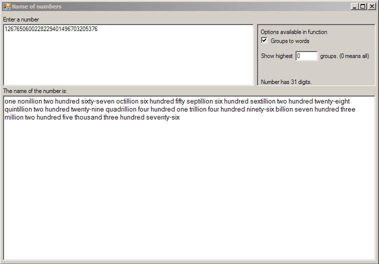



## Number to Words converter

### Description

Converts number to words with a very, very high limit on the size of the number using the United States number naming convention up to millillion (10^3003). Updates text dynamically. Other display options.
 
### More Info
 
Form code is included to demostration purposes. The entire code in a module so it can be easily moved to another application.

             |
---                |---
**Submitted On**   |2006-12-13 17:00:32
**By**             |[Dan2178](https://github.com/Planet-Source-Code/PSCIndex/blob/master/ByAuthor/dan2178.md)
**Level**          |Intermediate
**User Rating**    |5.0 (10 globes from 2 users)
**Compatibility**  |VB 5\.0
**Category**       |[Math/ Dates](https://github.com/Planet-Source-Code/PSCIndex/blob/master/ByCategory/math-dates__1-37.md)
**World**          |[Visual Basic](https://github.com/Planet-Source-Code/PSCIndex/blob/master/ByWorld/visual-basic.md)
**Archive File**   |[Number\_to\_20375312132006\.zip](https://github.com/Planet-Source-Code/dan2178-number-to-words-converter__1-67376/archive/master.zip)

